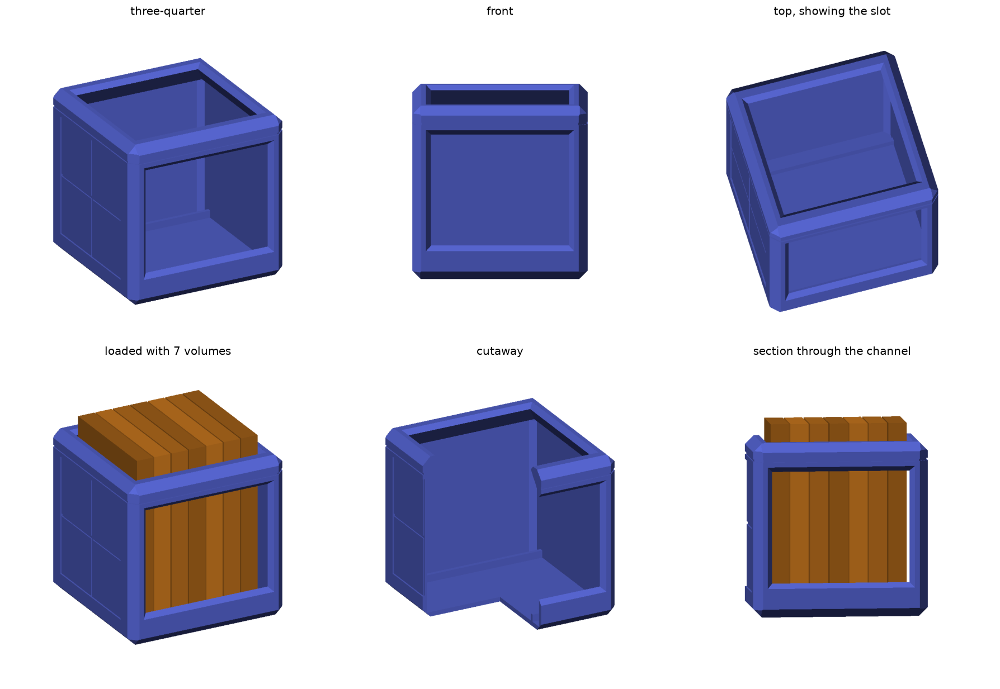

# Manga Loot Cube — A1 mini

A 178 mm bevelled cube that holds standing manga volumes: a drop-in slot in the
top, a display window in the front, recessed panels and a lid seam for the
Overwatch-loot-box look. One piece, no supports, no assembly.



```
python3 -m pip install -r requirements.txt
python3 src/manga_loot_cube.py --out stl      # writes the STL
PYTHONPATH=src python3 src/verify.py          # geometry + printability checks
PYTHONPATH=src python3 src/render.py --out docs
```

`stl/manga_loot_cube_a1mini.stl` is the print file.

## The one constraint worth knowing before you print

A Viz shonen volume (Naruto, My Hero Academia) is **127 × 190.5 × ~20 mm**. The
A1 mini's build volume is **180 × 180 × 180 mm**.

The book is taller than the machine's maximum Z. No one-piece cube from this
printer can fully swallow an upright volume, so this design doesn't pretend to:
the volumes stand on the floor and their spines deliberately rise **17.5 mm
proud of the top face**, framed by the slot, like a magazine caddy.

The alternatives were measured and are worse:

| approach | result |
| --- | --- |
| Books lying flat | 190 mm won't fit a 168 mm interior in any orientation |
| Books leaning at 35–45° | Fits, but holds only 1–2 volumes |
| Fully enclosed upright | Needs a ~210 mm cube, so a split multi-part print |
| **Upright, spines proud** | **7 volumes, one piece — this design** |

If you'd rather have the books fully hidden, that's the split-print route and
it's a different model — say the word.

## Specification

| | |
| --- | --- |
| Exterior | 178 mm cube (1 mm plate margin each side) |
| Capacity | 7 volumes at 20 mm, or 6 comfortably |
| Walls / floor | 5 mm |
| Top slot | 140 × 133 mm, flared, funnelled |
| Front window | 140 mm wide, 115 mm tall, 30 mm retaining lip |
| Edge treatment | 9 mm edge chamfer, 17 mm corner chamfer |
| Solid volume | 669 cm³ |

## Printing

No supports anywhere. Every opening flares outward at 45°, and the internal
funnel from the cavity to the slot is held clear of 45° on purpose, so the
undersides bridge themselves. `verify.py` asserts this against the mesh.

- **Supports:** off
- **Layer height:** 0.2 mm
- **Walls:** 3 perimeters
- **Infill:** 10–15% gyroid — the 5 mm walls do the work
- **Brim:** not needed; the flat 160 mm base is plenty of adhesion
- **Filament:** roughly 450–550 g, and somewhere around 20–30 h. Slice it for
  real numbers — that's an estimate from the solid volume, not a measurement.

The widest point is the middle of the cube; the base is 160 mm, and the walls
flare out to 178 mm at 45°, which prints cleanly.

## Changing it

Everything lives in the `PARAMETERS` block at the top of
`src/manga_loot_cube.py`. Change a number and re-run.

`validate()` refuses parameter sets that would quietly produce a bad print —
an opening whose flare would notch the edge chamfer, a slot too small for the
book, a seam that cuts across the panels, walls left too thin under the
grooves. `verify.py` then checks the built mesh itself: that the floor and
walls exist, that the openings are open, that a volume can drop through the
slot and clear the shell, and that nothing overhangs past 45° by more than a
bridgeable 2.5 mm.

Useful knobs:

- `BOOK_DEPTH` / `BOOK_HEIGHT` / `BOOK_THICK` — retarget to another format
  (VIZBIG omnibus is ~152 × 216 × 40 mm, and will need a split print)
- `SLOT_W` — capacity, capped by the top edge chamfer
- `EDGE_CHAMFER` / `CORNER_CHAMFER` — how soft the bevel reads
- `PANEL_INSET` / `PANEL_DEPTH` — the recessed face panels
- `MARGIN` — raise it if your plate complains at 178 mm
