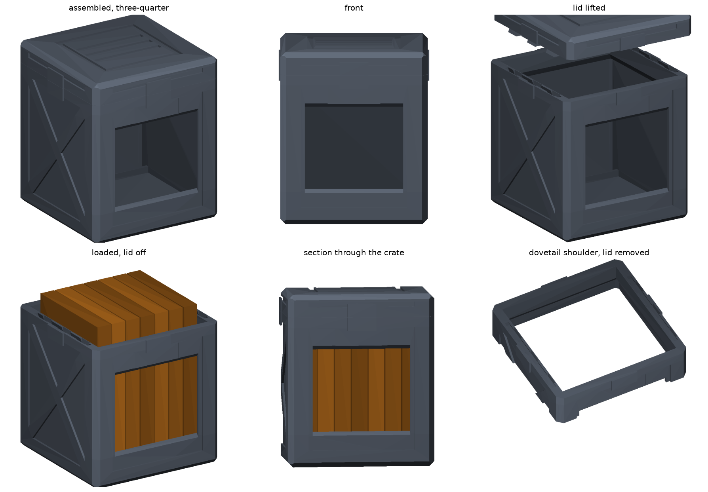

# Manga Cargo Crate — A1 mini

A two-part sci-fi cargo crate for standing manga volumes: corner castings,
X-braced recessed panels, heavy latch blocks, a front viewing hatch and a
banded lid. Body and lid lock together with a sliding dovetail. No supports,
no glue, no hardware.



```
python3 -m pip install -r requirements.txt
python3 src/manga_crate.py --out stl            # writes both STLs
PYTHONPATH=src python3 src/verify_crate.py      # geometry, fit, lock, printability
PYTHONPATH=src python3 src/render_crate.py --out docs
```

Print files: `stl/manga_crate_body.stl` and `stl/manga_crate_lid.stl`. Both are
exported print-ready — the lid is already flipped crown-down.

## Two constraints that shaped this

**A manga volume is taller than the printer.** Viz shonen volumes (Naruto, My
Hero Academia) are 127 × 190.5 × ~20 mm. The A1 mini's build volume is
180 × 180 × 180 mm, so no single piece can enclose one standing up.

**Splitting buys height, not width.** Each part still has to fit the 180 mm
plate, and any 2-way split of a 210 mm cube leaves at least one piece carrying
a full 210 × 210 cross-section. The largest square that fits inside a 180 mm
cube is ~191 mm, so that piece cannot be printed in any orientation — a true
210 mm cube needs 8 parts. Two parts gets you height only. Hence a
cube-proportioned body with a lid, 178 × 178 × 205 mm assembled, rather than a
true cube.

## The lock

The lid **cannot slide the full length of the crate** — it descends over spines
standing 19.5 mm above the body, so a full-length slide would drive its walls
straight through the books. Instead:

1. Drop the lid on sitting **8 mm forward**. Three pairs of dovetail tenons
   descend into drop-in pockets at the ends of their channels.
2. Push the lid back until it is flush.
3. Each tenon is now under its undercut lip. The lid cannot lift off.

Verified in `verify_crate.py`, which sweeps the descent and the slide for
collisions and then checks that lifting the locked lid is actually blocked:
0.30 mm of vertical play before the dovetail bites.

## Specification

| | |
| --- | --- |
| Assembled | 178 × 178 × 205 mm |
| Body / lid | 178 × 178 × 178 mm / 178 × 178 × 33 mm |
| Capacity | 7 volumes at 20 mm, or 6 comfortably |
| Walls / floor | 8 mm / 7 mm, 13 mm at the lid rim |
| Front hatch | 116 × 98 mm, self-supporting head |
| Lock | 6 dovetail tenons, 8 mm travel, 0.20 mm fit |
| Solid volume | 757 cm³ body, 280 cm³ lid |

## Printing

No supports on either part. Every opening flares 45°, the funnel into the lid
rim is held clear of 45°, and both large recesses (the base shadow line and the
crown) are narrow grooves rather than wide pockets, so nothing needs to bridge
more than 10 mm. `verify_crate.py` asserts this against each part in its own
print orientation.

- **Supports:** off
- **Layer height:** 0.2 mm
- **Walls:** 3 perimeters
- **Infill:** 10–15% gyroid
- **Orientation:** as exported. The lid prints crown-down, which puts its best
  surface on the plate and leaves no internal overhang.
- **Filament:** roughly 700–850 g for the pair. That's extrapolated from solid
  volume — slice it for real numbers.

If the dovetail is tight on your printer, raise `FIT`; if the lid rattles,
lower it. 0.20 mm per side is the starting point.

## Changing it

Everything is in the `PARAMETERS` block of `src/manga_crate.py`. Useful knobs:

- `BOOK_DEPTH` / `BOOK_HEIGHT` / `BOOK_THICK` — retarget to another format
- `TOTAL_H`, `SPLIT` — overall height and where the seam falls
- `RELIEF_FRAME` / `RELIEF_FIELD` — how deep the panel relief cuts
- `POST_L`, `BRACE_W`, `LATCH_W` — the crate detailing
- `TRAVEL`, `DT_*`, `FIT` — the dovetail
- `MARGIN` — raise it if your plate complains at 178 mm

Two structural rules the code relies on, worth knowing before editing:

- All exterior relief is **cut from** the 178 mm envelope, never added to a
  smaller body, so no detailing can push a part past the build plate.
- `skin_side()` exists because `profile()` insets in Z as well as X and Y, so a
  plain `skin()` carries full-width slabs at the crown and base. Cutting with
  those shaves the ends; clipping them off in Z instead lands a cut plane on
  the inset profile's end face and detaches them into separate bodies. Use
  `skin()` only for detail on the crown or the base.

The earlier single-piece 178 mm cube version is in git history at the first
commit on this branch.
