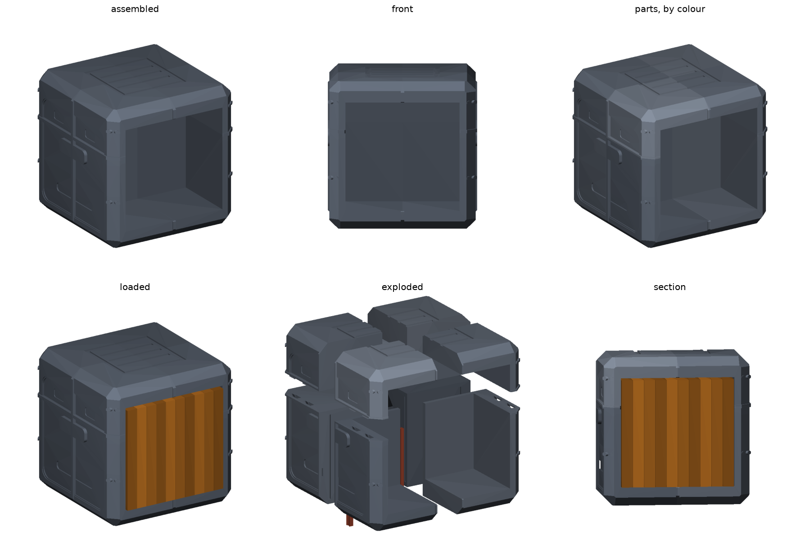

# Manga Cargo Cube — A1 mini

A **true 264 mm cube** — same on every axis — printed in 12 parts that lock
together with no glue, no screws and no supports.

The cube is **solid but for one book pocket**: a single wide slot milled into
the block, opening on the front face. Ten volumes slide in pressed together,
snug on all four sides, standing 3 mm proud so you can grip a spine. No
dividers, so nothing draws a line across the front. No open bay, no lid to
lift.

The exterior copies **crate C** from the reference art: light corner posts and
a deep top cap band standing at the envelope, field panels recessed between
them, a latch plate on the centre of each face, a wide louver recess low on the
panel, and small label placards. A big even soft bevel on every edge and
corner. The **lid line sits at two-thirds height**, which is where the tier
split actually falls — the structural seam is the styling. Detail runs
**across** the joints rather than stopping at them, and each split hides under
a 6 mm strap, so eight octants read as one object.

Nothing about the styling changed how it cuts: all relief is subtracted from
the 264 mm envelope, so the split planes, the locks and the print orientations
are untouched.



```
python3 -m pip install -r requirements.txt
python3 src/manga_cube.py --out stl          # writes all 12 STLs
PYTHONPATH=src python3 src/verify_cube.py    # parts, fit, locks, printability
PYTHONPATH=src python3 src/render_cube.py --out docs
```

## Why 12 parts

A 216 mm cube has no piece that fits the A1 mini's 180 mm plate whole. Any
2-way split of a cube over 180 mm leaves at least one piece carrying a
full-width cross-section, and the largest square that fits inside a 180 mm cube
is only ~191 mm — so **all three axes have to be split**. 2 × 2 × 2 is the
coarsest split that works: eight 108 mm octants, plus four spline keys.

264 mm is set by capacity, not by the book: ten spines pressed together are
202 mm across, and the pocket needs a solid margin either side wide enough to
carry the cap's dovetail channels. At 224 mm that margin falls to 11 mm and the
lock has nowhere to live.

## What the reference could not give us

Crate C's corner posts are far chunkier than these. They cannot be: the pocket
for ten volumes is 202 mm of the 264 mm face, so only 31 mm of margin remains
either side, and the posts have to live in it. The front face is mostly pocket
for the same reason, so the crate styling is carried by the other three faces,
the cap band and the foot band.

## How it locks

The hard part is that **four pieces in a closed ring cannot all use the same
sliding joint** — the last one would have to slide two directions at once. So
the two tiers lock differently:

**Lower ring** — the four base octants butt together, then four dovetail
spline keys drop down the vertical seams. Each key is a *bowtie* in section,
widest at both roots and pinched at the seam, so neither octant can pull away
sideways. Once the cap is on, the keys are trapped and cannot back out.

**Cap** — each upper octant locks to the body **on its own**: set it down 8 mm
forward, lower it so two dovetail tenons drop into their pockets, then slide it
back. The channels are blind, so it stops exactly flush. Because no cap piece
depends on its neighbours, the ring-of-four problem never arises.

`verify_cube.py` proves the mechanism rather than assuming it: for every cap
octant it sweeps the descent and the slide for collisions, confirms the blind
channel stops it (43 mm³ of interference if pushed 1 mm past flush), and
confirms it cannot be lifted — 0.60 mm of play before the dovetail bites. It
also pulls a base octant sideways and checks it fouls its key.

## Assembly

1. Butt the four `base_*` octants together on a flat surface.
2. Drop `key_1`–`key_4` down the vertical seams. The lower ring is now locked
   laterally.
3. For each `cap_*` octant: set it on its quarter 8 mm forward, lower it, slide
   it back until it stops. It is now locked down and the keys beneath are
   captive.

## Specification

| | |
| --- | --- |
| Assembled | 264 × 264 × 264 mm, true cube |
| Parts | 8 octants (176 mm base, 94 mm cap) + 4 spline keys |
| Capacity | 10 volumes, pressed together in one pocket |
| Pocket | 202 × 124 × 194 mm — 2 mm slack over 10 spines, books 3 mm proud |
| Floor / ceiling | 34 / 36 mm |
| Lid line / tier split | 176 mm, two-thirds height |
| Cap lock | 8 dovetail tenons, 8 mm travel, blind channels, 0.20 mm fit |
| Material | 9980 cm³ solid across all parts |

## Printing

No supports anywhere. All relief is cut into the envelope, openings flare 45°,
and both wide recesses are narrow grooves instead, so nothing bridges more than
10 mm. `verify_cube.py` asserts this against each part in its own orientation.

- **Supports:** off · **Layer:** 0.2 mm · **Walls:** 3 · **Infill:** 10–15%
- **Orientation:** as exported. Base octants sit floor-down, cap octants are
  already flipped crown-down, keys stand on end.
- **Filament: roughly 2.0–2.4 kg**, and a long queue of 12 large prints. This
  is the real cost of ten volumes: capacity set the cube size, and volume goes
  as the cube of it. A solid cube is mostly infill rather than plastic, so this
  sits well under the 10135 cm³ solid figure — but it is an estimate, so slice
  it for real numbers. **`N_BOOKS` is the knob**: dropping to 6 returns the
  cube to 224 mm and about 1.4 kg.

If the dovetails or keys are tight on your printer, raise `FIT`; if they
rattle, lower it. 0.20 mm per side is the starting point.

## Changing it

Everything lives in the `PARAMETERS` block of `src/manga_cube.py`.

- `N_BOOKS` — capacity, and the thing that sets `SIDE`
- `SIDE` — the cube. Below ~213 mm the book no longer fits standing
- `BASE_H`, `CAP_H`, `POST_L`, `PLATE`, `VENT`, `PLACARD` — the crate C
  exterior. `POST_L` is capped by the pocket margin
- `N_BOOKS`, `SLOT_*`, `BOOK_*` — the pocket and the media it is cut for
- `EDGE_CH` / `CORNER_CH`, `PANEL_R`, `EMBLEM_*`, `SEAM_Z` — the loot-box look:
  bevel size, panel corner radius, the disc plate, and the lid line
- `VOID_*` — the hidden chambers behind the slot backs
- `RELIEF_FRAME` / `_BEVEL` / `_FIELD` / `_VENT` — the four relief planes.
  `RELIEF_VENT` must stay well clear of `WALL` or the louvers cut through
- `TRAVEL`, `DT_*`, `KEY_*`, `FIT` — the locks

Four rules the code depends on:

- All exterior relief is **cut from** the envelope, never added to a smaller
  body, so no detailing can push a part past the plate.
- The seam straps sit at the full envelope **on purpose**: every split line
  lands under one, so a joint reads as a strap rather than a crack. The
  horizontal one doubles as the loot-box lid line.
- The emblem is offset sideways because a face-centred disc would be bisected
  by the vertical seam strap.
- `skin_side()` exists because `profile()` insets in Z as well as X and Y, so a
  plain `skin()` carries full-width slabs at the crown and base. Cutting with
  those shaves the ends; clipping them off in Z instead lands a cut plane on
  the inset profile's end face and detaches them into separate bodies.
- `cleanup()` drops hairline boolean debris. Meshes are exported **raw**:
  welding them to satisfy `is_watertight` turned point-pinches into real holes.
  `mesh_report()` counts boundary edges instead, which is the property that
  actually matters — all 12 parts have zero.
- The hidden chambers are **gabled, and split into strips**. A flat-roofed
  buried void is thousands of mm² of ceiling that no support could ever be
  removed from; and a 45° gable only closes over twice its own rise, so a
  chamber deeper than that is divided into strips that can each roof
  themselves. The upper chamber is short and deep and needs this.

## Assembly note

Loading is through the pocket only — the cap octants do come off individually
(slide one forward 8 mm and lift), but you never need to.

Earlier designs — a one-piece 178 mm cube, a two-part 178 × 178 × 205 mm crate,
a 216 mm open-bay cube, a six-slot version with dividers, and a 224 mm
six-volume cube — are in git history on this branch.

## Two-tone

Printing the four `cap_*` parts and the keys in cream and the four `base_*`
parts in yellow puts the light band across the top third, which is where crate
C's light lid sits.

It will not colour the corner posts, though — those run the full height and so
are split between both tiers. Matching the reference exactly needs either a
multi-colour print or the posts broken out as separate clip-on pieces, which
would add four more parts.
